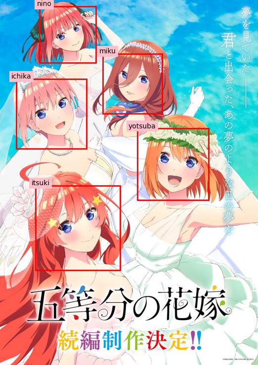
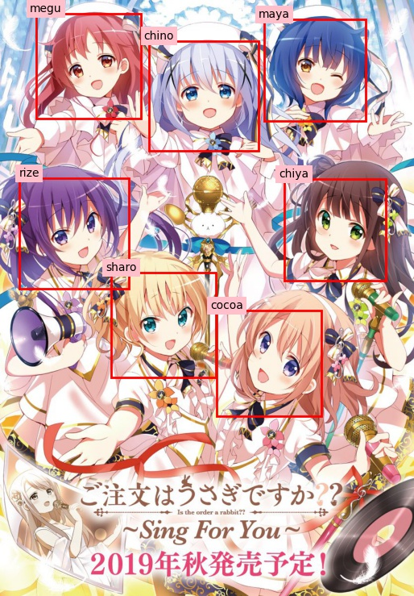

# yotsubanet

An all-in-one solution for training anime face classification models by leveraging Reddit webscraping.

# Introduction
Machine learning classifier require a large dataset of labelled data for satisfactory performance. This generally requires established, curated datasets such as [ImageNet](https://www.image-net.org/) or [CIFAR-10/CIFAR-100](https://www.cs.toronto.edu/~kriz/cifar.html).

For the problem of anime face classification, large datasets such as [Anime-Face-Dataset](https://github.com/bchao1/Anime-Face-Dataset) and [Danbooru2020](https://www.gwern.net/Danbooru2020#danbooru2018) exist, but they are primarily designed for generative or detection tasks.

In this project, we leverage Reddit fan communities as a source of labelled data for targeted classification. Assuming an anime property is popular enough, one can find many sources of labelled image data through webscraping. In our implementation, we use the following sources.

We design a job-based interface for constructing a webscraping routine through [Reddit's PRAW API](https://pypi.org/project/praw/), and include some common dataset cleanup routines that can automate improvement of the dataset quality.

A complete CNN backbone (Resnet18) is also provided, and has been validated to work sufficiently well on test tasks.

# Install and Run
1. Clone this repository.
2. Ensure Python 3.6+ is installed.
3. Navigate to main directory. 

    `$ cd /path/to/cloned/repository`

4. Install requirements.

    `$ pip install -r requirements.txt`

    **Note, imgur-downloader is broken at time of writing, and the main file is included in the repo for importing purposes.**

5. Download [lbpcascade_animeface](https://github.com/nagadomi/lbpcascade_animeface) HAAR cascade file. 

    - On Linux

    `$ wget https://raw.githubusercontent.com/nagadomi/lbpcascade_animeface/master/lbpcascade_animeface.xml`
    
    - On Windows, right click "Save Link As" [lbpcascade_animeface.xml](https://raw.githubusercontent.com/nagadomi/lbpcascade_animeface/master/lbpcascade_animeface.xml) and place `lbpcascade_animeface.xml` in the main yotsubanet directory.

6. **(Optional)** Set up Reddit credentials at `config/reddit_praw_login_details.py` by creating a script app at [https://old.reddit.com/prefs/apps/](https://old.reddit.com/prefs/apps/). A working scraper bot agent's credentials are provided by default, but not guaranteed to work.
6. Configure custom scraper session JSON with jobs. See **Configuring Job JSON** section for details.
7. Run webscraper, webscraper output will be saved to a **session directory**, defined in the `-o` argument. 

    `$ python run_webscraper.py -i /path/to/session/joblist.json -o /path/to/session/dir -p process_count`

8. **(Recommended)** Do manual data cleanup. Running automated cleanup in post is also recommended:

    `$ python run_cleanup_only.py -i /path/to/session/joblist.json -o /path/to/session/dir`

9. Run CNN classifier training, use webscraper session directory as input.  

    `$ python run_classifier_training.py -i /path/to/session/dir`

10. Test classifier predictions on unlabelled faces. 

    `$ python run_model_evaluation.py -i /path/to/session/dir`

11. Detect faces and classify from single image.

    `$ python run_eval_single_image.py -i /path/to/session/dir -f /image/to/eval.png`

## Notes
Python scripts can be alternatively run without CLI arguments by editing global constants in scripts.

In `run_webscraper.py`:
```python
SESSION_FILE = "examples/gotoubun_no_hanayome/gotoubun_no_hanayome.json"
SESSION_DIR = "goutoubun_no_hanayome"
PROCESSES = 4
```

# Testing Model on Images
After model training, run the following file after modifying settings:
    `$ python run_eval_single_image.py`

```python
FILE_TO_EVAL = "path/to/image.png"
OUTPUT_FILE = "path/for/saved/image.png"
SESSION_DIR = "session_directory"
DEVICE = "cuda:0" OR "cpu"

USE_BEST = False

# Viola cascade parameters. Worth tuning for images to detect faces properly.
CASCADE_MIN_NEIGHBORS = 6
CASCADE_SCALE = 1.01
```
Modifying the cascade variables is recommended to fine-tune face detection, especially for large images.

## Example Classification Results

### Gotoubun no Hanayome


- Original image from https://pbs.twimg.com/media/ExVxLqtUUAErTkv.jpg?name=large.
- Resnet18 weights used for image predictions available at https://drive.google.com/drive/folders/16_eOyHU0StlwjiNaCKDfr7A1tgpui0xk?usp=sharing.
- Dataset used for model training included in repo, extract with:

    `$ gzip -d test_dataset.tar.gz`

### Gochuumon wa Usagi desu ka?


- Original image from https://www.gochiusa.com/news/hp0001/index07030000.html.
- Resnet18 weights and dataset used are available at https://drive.google.com/drive/folders/16_eOyHU0StlwjiNaCKDfr7A1tgpui0xk?usp=sharing.

Webscrapers and models were tested on Linux Mint 20.2 and Windows 10 ver 2004, (OS Build 19041.1288).

# FAQ
1) Can the program be used without a CUDA-capable GPU?
    - When running classifier training (`run_classifier_training.py`) or evaluation (`run_model_evaluation.py`, `run_eval_single_image.py`), add `-d cpu` to train/evaluate networks on the CPU.
    - Alternatively, modify the following global constant in each of the files.

        ```python
        # DEVICE = "cuda:0"
        # Change the above line to -->
        DEVICE = "cpu"
        ```
        
    - Note that CPU training increases the training time significantly.
2) How to use the pre-trained weights for face recognition in single images?
    - Ensure [lbpcascade_animeface](https://github.com/nagadomi/lbpcascade_animeface) HAAR cascade file is in the main yotsubanet directory. 

        `$ wget https://raw.githubusercontent.com/nagadomi/lbpcascade_animeface/master/lbpcascade_animeface.xml`

    - Download the weights from https://drive.google.com/drive/folders/16_eOyHU0StlwjiNaCKDfr7A1tgpui0xk?usp=sharing, run the follwing.

        `$ python run_eval_single_image.py -i yotsubanet_misc/gochiusa -f /path/to/single/image.png`

    - If some faces are not detected, or if you are detecting non-faces, fine-tune the HAAR cascade detection parameters in `run_eval_single_image.py`.

        ```python
        # Viola cascade parameters for Gotoubun no Hanayome Movie Key Visual
        CASCADE_MIN_NEIGHBORS = 6
        CASCADE_SCALE = 1.01
        # For Gochiusa image, CASCADE_MIN_NEIGHBORS was set to 60.
        ```

3) Why use model training endpoint instead of checkpoint with best loss?
    - Due to the small size of the webscraped dataset, the validation loss is less indicative of good model generalizability. Using the training endpoint seems to give better performance, but can be overridden by appending `-b 1` on evaluation scripts.
4) Why Resnet18? Why a batch size of 16?
    - GPU training was tested on an Nvidia MX150 (2GB), which runs into memory issues with larger models and batch sizes.
    - The relative simplicity of the face classification problem does not significantly benefit from larger models. Preliminary tests with Resnet50 models show similar loss curves with double the computational cost.
    - https://arxiv.org/abs/1804.07612 indicates that small batch sizes help with model generalizability, which is prudent for our networks which lack a sufficiently large dataset.
5) What is the default network training protocol?
    - AdamW optimizer `(lr=0.001, eps=0.1)` with cross-entropy loss criterion.
    - Batch size 16
    - Validation split of 20%
6) What are the targets for the webscraper?
    - Image posts on character-specific subreddits (i.e. images of Yotsuba from [/r/Yotsubros/](www.reddit.com/r/Yotsubros/))
    - Image posts on a property-specific title with a character's name in title (i.e. posts titled 'Yotsuba' from [/r/5ToubunNoHanayome/](https://www.reddit.com/r/5ToubunNoHanayome/))
    - Image links in comments of anime discussion posts with a character's name in link text (i.e. [comment links with text string 'Yotsuba'](https://www.reddit.com/r/anime/comments/m80o69/comment/greqvhm/?utm_source=share&utm_medium=web2x&context=3) from episode discussion threads on [/r/anime](www.reddit.com/r/anime))
7) What automated cleanup is done when calling `run_cleanup_only.py` or `run_webscraper.py`?
    - Similar images or duplicates are determined with difference hashing (`dhash`).
        - Perceptual hashing (`phash`) is also available, but overly sensitive when applied on anime face images.
        - Average hashing (`ahash`) performs roughly equivalent to `dhash`, but is marginally slower due to a `mean()` operation.
        - Can be bypassed by commenting out the following line in `run_webscraper.py` or `run_cleanup_only.py`:
            ```python
            dataset_cleaner.remove_duplicates()
            ```
        - Duplicates can be previewed by un-commenting following line in `run_webscraper.py` or `run_cleanup_only.py`:
            ```python
            # dataset_cleaner.inspect_duplicates()
            ```
    - Grayscale image removal.
        - Grayscale images potentially harm model training due to the lack of color features.
        - Grayscale detection and removal is currently not perfect, but gets rid of most grayscale images.
        - Can be bypassed by commenting out the following line in `run_webscraper.py` or `run_cleanup_only.py`:
            ```python
            dataset_cleaner.remove_grayscale()
            ```
        - Grayscale images can be previewed by un-commenting following line in `run_webscraper.py` or `run_cleanup_only.py`:
            ```python
            # dataset_cleaner.preview_grayscale()
            ```
8) Why "yotsubanet"?
    - The name **'yostubanet'** was inspired by the 2021 anime 五等分の花嫁∬  *(Gotoubun no Hanayome ∬)*, the initial toy problem which the project was designed on.
    - This was a joke project taken too far.

# Features
The primary component in this package is the Reddit webscraper, which includes the following features:
- Reddit image scraping with PRAW
    - Reddit comment link scraper
    - Reddit image post scraper
    - Image downloader (with Imgur and Reddit gallery support)
    - Multiprocessing support
    - #TODO ~~Job creator CLI utility~~
- Dataset preparation
    - Face detection
    - Image crop and rescaling
    - Labelled and unlabelled data sorting
- Dataset cleanup
    - Image similarity detection with perceptual hashing
        - `phash`, `dhash` and `ahash` algorithms
    - Grayscale/manga image removal
- Dataset visualization

For CNN classifier training, a Pytorch backbone is provided, with a complete Resnet18 model included by default.
- Dataset per-class max size constraint
    - For datasets with unbalanced class sizes.
- Multiple normalization methods
    - Dataset-wide automatic channel normalization (default)
    - Per-image normalization layer (using `nn.Sequential` wrapper)
- One-liner model training with modularity
    - Tracks and save model with best validation loss.
- Visualize model predictions
- Extract and classify faces from images.

While Pytorch is used, the webscraper outputs are in can be used with any machine learning framework or techniques.

# Requirements
- Python v3.6+
- [PRAW](https://pypi.org/project/praw/)
- [imgur_downloader](https://github.com/jtara1/imgur_downloader)
- [lbpcascade_animeface](https://github.com/nagadomi/lbpcascade_animeface)
- [Pytorch](https://pytorch.org/)
- [torchvision](https://pytorch.org/vision/stable/index.html)
- [OpenCV](https://opencv.org/)
- [PIL](https://python-pillow.org/)
- [Numpy](https://numpy.org/)
- [matplotlib](https://matplotlib.org/)
- [Scipy](https://scipy.org/)

# Configuring Job JSON
Sample webscraper session JSON for Gotoubun no Hanayome task is available under `./examples/gotoubun_no_hanayome/gotoubun_no_hanayome.json`.

```yaml
{
    # Define "labels" as list object
    "labels": ["ichika","nino", "miku", "yotsuba", "itsuki"],
    # Add jobs to list of "jobs"
    "jobs": [
        # Jobs have 2 TYPEs, 
        ## 1) TYPE = "comment_links"
        {
            "TYPE": "comment_links",
            "SUBREDDIT": "anime",   # r/SUBREDDIT, case-sensitive
            "SEARCH_QUERY": "Go-toubun no Hanayome Episode Discussion", # Search term.
            "THREAD_FLAIR": null,   # Thread flair filter. Temporarily unimplemented for TYPE=comment_links
            "LABEL": "yotsuba"      # Label to search for in text links. Each label is assigned to a single job for multiprocessing.
        },
        ## 2A) TYPE = "subreddit_posts" - Search submissions/posts from property-specific subreddits.
        {
            "TYPE": "subreddit_posts",
            "SUBREDDIT": "5ToubunNoHanayome",   # r/SUBREDDIT, case-sensitive
            "SEARCH_QUERY": "yotsuba",           # Search term, can be null to get all posts.
            "THREAD_FLAIR": "Fanart",       # thread flair filter, check subreddit for proper convention.
            "LABEL": "yotsuba"               # label to scrape for.
        },
        ## 2B) TYPE = "subreddit_posts" - Search submissions/posts from character-specific subreddits.
        {
            "TYPE": "subreddit_posts",
            "SUBREDDIT": "IchikaFanclub",   # r/SUBREDDIT, case-sensitive
            "SEARCH_QUERY": null,           # Search term, can be null to get all posts.
            "THREAD_FLAIR": "Fanart",       # thread flair filter, check subreddit for proper convention.
            "LABEL": "Yotsubros"            # label to scrape for.
        }
    ]
}
```

# To-do list:
## Webscraper
- Implement CLI session and job generator.
- Add thread flair filter for comment jobs.
- ~~Modify session files to be in JSON format for easier parsing.~~
- ~~Test on alternative labelled dataset.~~
- Finetune grayscale detection threshold value.
- Sort out tests and provide clear example.
- Add detailed documentation.
- Add references.

## Machine Learning
- ~~Add early stopping constraint~~
- Add alternative model wrappers.

# References
- Viola, P., & Jones, M. (2001, December). Rapid object detection using a boosted cascade of simple features. In Proceedings of the 2001 IEEE computer society conference on computer vision and pattern recognition. CVPR 2001 (Vol. 1, pp. I-I). Ieee.
- He, K., Zhang, X., Ren, S., & Sun, J. (2016). Deep residual learning for image recognition. In Proceedings of the IEEE conference on computer vision and pattern recognition (pp. 770-778).
- Masters, D., & Luschi, C. (2018). Revisiting small batch training for deep neural networks. arXiv preprint arXiv:1804.07612.
